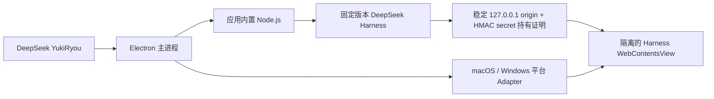

<p align="center">
  
</p>

<h1 align="center">DeepSeek YukiRyou — DeepSeek Harness Desktop for macOS & Windows</h1>

<p align="center">
  <strong>让 DeepSeek Harness 真正成为桌面应用。</strong><br>
  面向 macOS 与 Windows 的独立工作台：内置运行时、Workspace Review、受管插件市场与可恢复的桌面生命周期。
</p>

<p align="center">
  <a href="https://github.com/yoshino-xiao7/deepseek-harness-desktop-yukiryou/releases/latest"></a>
  
  
  
  <a href="LICENSE"></a>
</p>

<p align="center">
  <strong>简体中文</strong> · <a href="README_EN.md">English</a>
</p>

<p align="center">
  <a href="https://github.com/yoshino-xiao7/deepseek-harness-desktop-yukiryou/releases/latest">下载最新版</a>
  ·
  <a href="#下载与安装">安装指南</a>
  ·
  <a href="#当前可用功能">功能</a>
  ·
  <a href="#本地开发">本地开发</a>
  ·
  <a href="docs/README.md">开发文档</a>
  ·
  <a href="https://github.com/yoshino-xiao7/deepseek-harness-desktop-yukiryou/issues">反馈问题</a>
  ·
  <a href="https://github.com/yoshino-xiao7/deepseek-harness-desktop-yukiryou">⭐ Star 支持</a>
</p>

---

## 目录

- [项目定位](#项目定位)
- [下载与安装](#下载与安装)
  - [macOS](#macos)
  - [Windows](#windows)
  - [校验下载文件](#校验下载文件)
- [当前可用功能](#当前可用功能)
- [为什么选择 YukiRyou](#为什么选择-yukiryou)
- [界面布局概览](#界面布局概览)
- [后续路线图](#后续路线图)
- [版本与更新](#版本与更新)
- [技术架构](#技术架构)
- [本地开发](#本地开发)
- [固定运行时](#固定运行时)
- [常见问题](#常见问题)
- [文档导航](#文档导航)
- [参与项目](#参与项目)

## 项目定位

官方 DeepSeek Harness 提供 Web UI，但日常使用仍需要准备运行环境、启动命令、管理本地端口和处理异常退出。DeepSeek YukiRyou 把这些工作收进一个可安装的跨平台桌面应用：应用启动时拉起内置 Harness，退出时回收自己创建的进程，并用原生窗口承载完整 Web UI。

它不是 Harness 的重写版本，也不会改变 Agent 的工作方式。它专注于把 Harness 稳定、安全、可恢复地交付到桌面，并在官方界面之外补足账户状态、工作区文件和变更审核等桌面能力。

> 当前支持 Apple Silicon macOS 14+ 与 Windows 11 x64。Intel Mac、Windows on Arm 和 Linux 暂不支持。

| 打开即用 | 原生体验 | 可诊断 | 安全更新 |
| --- | --- | --- | --- |
| 内置固定版本的 Node.js、pnpm 与 Harness | 平台化窗口、主题同步、响应式 Workspace Review | 自动恢复运行时、日志轮转、脱敏诊断包 | macOS 签名和公证；Windows 真实安装生命周期验证与候选门禁 |

## 下载与安装

所有公开产物均可从 [GitHub Releases 最新版本](https://github.com/yoshino-xiao7/deepseek-harness-desktop-yukiryou/releases/latest) 下载。

### macOS

系统要求：Apple Silicon Mac（M1 或更新芯片）、macOS 14 或更高版本。

每个版本提供两种产物：

```text
DeepSeek.YukiRyou-<version>-arm64.dmg
DeepSeek.YukiRyou-darwin-arm64-<version>.zip
```

**使用 DMG 安装：**

1. 下载并打开 DMG。
2. 将 **DeepSeek YukiRyou** 拖入“应用程序”。
3. 从 Launchpad 或“应用程序”目录启动。
4. 在 Harness 界面中完成所需的服务配置，然后开始工作。

**使用 ZIP：**

1. 下载并解压 ZIP。
2. 将 **DeepSeek YukiRyou.app** 移入“应用程序”。
3. 从“应用程序”目录启动。

macOS 应用和更新包均使用 Developer ID 签名并经过 Apple 公证。

### Windows

系统要求：Windows 11 x64。

每个版本提供安装版和便携版：

```text
DeepSeek.YukiRyou-<version>-win32-x64-Setup.exe
DeepSeek.YukiRyou-win32-x64-<version>-portable.zip
```

**使用安装版：**

1. 下载并运行 `Setup.exe`。
2. 在 NSIS 安装向导中选择安装目录并完成安装。
3. 从开始菜单或安装目录启动 **DeepSeek YukiRyou**。

**使用便携版：**

1. 下载并完整解压 ZIP。
2. 从解压目录运行应用；便携版不会写入安装注册项。

Windows 产物暂未进行 Authenticode 签名，系统可能显示 SmartScreen 警告。请只从本仓库的 Release 下载并完成 SHA-256 校验；未签名产物不代表已获得 Windows 系统的发布者信任背书。

### 校验下载文件

每个正式版本都提供 `SHA256SUMS.txt`（macOS）和 `SHA256SUMS-Windows.txt`（Windows）。先将安装包与对应校验文件下载到同一目录，再执行：

**macOS：**

```bash
shasum -a 256 DeepSeek.YukiRyou-<version>-arm64.dmg
# 将输出与 SHA256SUMS.txt 中对应文件的值比较
```

**Windows PowerShell：**

```powershell
Get-FileHash .\DeepSeek.YukiRyou-<version>-win32-x64-Setup.exe -Algorithm SHA256
# 将输出与 SHA256SUMS-Windows.txt 中对应文件的值比较
```

海外发行以 GitHub Releases 为源；中国大陆自动选择受 ESA 保护的 [`download-cn.suzuki.ink`](https://download-cn.suzuki.ink) 国内镜像，失败时回退到 GitHub。镜像仅在 GitHub Release 已公开且全部校验通过后同步；其 [`downloads/latest.json`](https://download-cn.suzuki.ink/downloads/latest.json) 提供当前四个安装包的版本化直链、大小与 SHA-256。

## 当前可用功能

### 桌面与运行时

- **一体化窗口**：本地顶栏与 Harness 共享视觉状态，浅色、深色和跟随系统主题会同步生效。
- **固定运行时**：Node.js、pnpm 与 DeepSeek Harness 随应用交付，不读取用户的全局安装，也不会在首次启动时联网安装依赖。
- **安静的生命周期**：单实例运行；关闭窗口时可隐藏，重新点击 Dock 图标即可恢复。
- **故障自恢复**：Harness 或本地界面异常退出时分别恢复，避免单个区域的故障拖垮整个窗口。

### 账户与工作区

- **账户概览**：“设置”上方默认显示当前凭据所属账户余额；悬浮时在同一行切换为本机今日估算，点击可同时刷新两项。今日金额依据会话中的官方 usage 和北京时间峰谷费率估算，不作为官方账单。
- **Desktop Companion**：可收起的右栏提供当前工作区文件树、相对 HEAD 的 Git 变更、增删行统计和只读 diff。
- **适合阅读的预览**：Markdown 可在排版与源码之间切换，纯文本和常见图片也可在应用内预览。
- **逐轮变更入口**：在 Harness 原生“产物”行下方展示本轮确认变更，点击即可进入对应文件审核。

### 设置、安全与发布

- **单一外观入口**：浅色、深色和跟随系统统一使用“通用设置 → 外观”；“关于”展示版本、开发者信息与更新中心。
- **更新不打扰**：应用定时在后台检查；只有发现可安装版本时，主界面才显示更新入口。
- **隐私友好的诊断**：导出包只包含脱敏后的环境摘要和有界日志，不打包项目源码、会话或凭据。
- **可信发布链**：候选包经过平台对应的安装、启动和稳定性门禁；macOS 还必须通过 Developer ID 签名、Apple 公证和最终产物复验。

### 插件市场

- **完整目录发现**：市场基于完整本地索引提供搜索、分类、分页和自定义 HTTPS 来源管理，不把目录收录描述为官方认可或安全审核。
- **安装前安全预检**：核验目录/npm 身份、仓库回链、生命周期脚本、完整性、平台、Runtime、完整依赖图、Peer 兼容性和真实包体。
- **受管生命周期**：支持安装、更新、重装、启停、上一验证版本回滚和卸载；写入前需要原生确认，重启后健康失败会自动恢复。
- **明确权限边界**：插件与 Harness 共享本机用户权限；Renderer 不会获得 Runtime token、缓存路径或可执行安装计划。

## 为什么选择 YukiRyou

- **真正的跨平台桌面产品**：不是网页快捷方式。macOS 与 Windows 共享固定 Harness Runtime、核心能力和状态合同，平台差异收敛在窗口、路径、进程与安装适配层。
- **完整的工作区审阅闭环**：无需离开对话，即可查看文件树、相对 HEAD 的 Git 变更、逐轮产物、增删行统计、只读 diff 与 Markdown 预览。
- **融入 Harness，而不是取代 Harness**：账户概览、Desktop Companion、设置、插件市场和更新入口沿用 Harness 的交互节奏，不重写其 Agent 工作流。
- **可验证的发行结果**：公开产物来自受控工作流，附带 SHA-256；macOS 还经过 Developer ID 签名、Apple 公证、异机安装和最终产物复验。
- **可诊断、可恢复**：固定运行时、进程归属校验、日志轮转和脱敏诊断共同降低“换一台机器就无法复现”的桌面交付风险。

## 界面布局概览

应用保留 Harness 作为主工作区，并在同一窗口中补充桌面能力：

| 区域 | 主要内容 | 行为 |
| --- | --- | --- |
| 桌面顶栏 | 窗口拖动、桌面状态与 Companion 开关 | 始终由原生桌面壳管理 |
| Harness 主工作区 | 会话、Agent 工具、设置与插件 | 保持官方 Harness 的核心交互 |
| Desktop Companion | “变更”与“文件”两个视图 | 可收起、可调整宽度，不遮挡主工作区 |
| Workspace Review | 文件内容、只读 diff、Markdown 与图片预览 | 从 Companion 或逐轮产物进入，属于审阅视图而非独立工作流 |

## 后续路线图

| 功能 | 状态 | 计划范围 |
| --- | --- | --- |
| 手机远程控制 | **规划中** | 通过明确配对和权限边界，在手机端查看任务状态、接收必要提醒，并在用户确认后继续任务；不会直接暴露本机 Harness 端口。 |
| 插件生态完善 | **持续开发** | 在现有发现、预检和受管生命周期上继续补齐可信发布者信号、权限可见性和更完整的兼容性信息。 |

路线图表示产品方向，不承诺具体发布日期。安全模型、上游 Harness 接口或素材准备不足时，相关功能会继续保持不可用，而不是通过不稳定的 DOM 注入或降低系统安全要求提前上线。

## 版本与更新

应用启动后会自动检查更新，也可以在“设置 → 关于”中手动检查。中国大陆优先使用国内镜像，其他地区优先使用 GitHub；国内源不可用时自动回退到 GitHub。macOS 与 Windows 安装版均在后台下载更新，完成后由用户确认重启安装。

桌面壳、Node.js 与 Harness 被视为一个原子发布单元：应用不会在后台单独升级运行时，避免新旧组件组合产生不可复现的问题。正式发布固定执行一次 DMG 公证，再从已完成 staple 的 App 生成自动更新 ZIP。详细流程见 [发布 Runbook](docs/09-github-and-apple-release.md)。

<details>
<summary><strong>从早期测试版升级的注意事项</strong></summary>

从 `v0.2.1-beta.2` 升级到首个 rc.8 版本前，请先通过应用菜单完整退出旧版。旧版 Runtime 没有 owner watchdog，而一次性 origin 迁移依赖最后一条 ready 记录。

如果旧版曾被强制退出、主进程崩溃，或桌面日志曾被手动清理，请先重启 macOS 再安装，以免新旧 Runtime 并发写入数据。如果 ready 记录已经丢失，升级后可能需要从侧栏重新选择一次原会话。

</details>

## 技术架构



运行时边界分为以下几层：

- **本地监听**：Harness 只监听由应用持久选择的稳定回环地址，不向局域网暴露服务。
- **持有证明**：每次 Runtime 启动都必须通过随机密钥的 HMAC 挑战，证明响应者持有本次 secret。
- **迁移保护**：一次性旧日志迁移采用物理顺序中的最后一个 ready origin；轮转日志中保留的其他 ready 端口必须先释放。
- **失败关闭**：如果遗留 Runtime 仍占用端口，应用会在复制或打开 Runtime Home 前按失败关闭（fail-closed）原则中止操作。
- **渲染隔离**：网页运行在关闭 Node 集成、启用上下文隔离与沙盒的独立视图中；桌面桥只开放经过校验的少量能力。

HMAC 持有证明不等同于操作系统级进程隔离。完整边界见 [安全设计](docs/03-security.md)。

## 本地开发

### 准备环境

- Node.js 22.19+ 或 24+
- Corepack / pnpm 10.34.5
- macOS 开发：Apple Silicon Mac、macOS 14+
- Windows 开发：Windows 11 x64；Windows Runtime 必须在 Windows 主机装配

### macOS：启动与验证

```bash
corepack enable
pnpm install --frozen-lockfile
pnpm runtime:vendor -- --arch=arm64
pnpm dev
```

验证常规改动和 macOS 打包：

```bash
pnpm check
pnpm test:e2e
pnpm package:mac -- --arch=arm64
```

macOS 正式签名、公证和发行只通过 GitHub Actions 的 **Release desktop (macOS + Windows)** 工作流执行。本机只能生成不可发布的签名候选：

```bash
export MACOS_SIGN_IDENTITY="Developer ID Application: ... (...)"
pnpm release:mac:candidate
```

工作流使用多个全新 Apple Silicon runner：候选复制到 `/Applications` 后必须通过验签和启动验证，才能提交至 Apple 公证。公证后的 DMG 与 ZIP 还会在另一个 runner 上重新安装，并通过 Gatekeeper 验证和启动测试。全部门禁通过后只创建 Draft，获得显式允许后才公开 Release。

### Windows：启动与验证

在 Windows x64 主机执行：

```powershell
corepack enable
pnpm install --frozen-lockfile
pnpm runtime:vendor:win
pnpm runtime:verify
pnpm dev
```

生成并验证候选产物：

```powershell
pnpm check
pnpm test:e2e
pnpm make:win
```

仓库的 **Windows x64 candidate** 工作流会验证向导式 NSIS 安装 EXE 与便携 ZIP，并真实执行自定义目录安装、启动、修复安装与卸载。正式桌面发行工作流将版本化 EXE、便携 ZIP 和 Windows SHA-256 清单加入与 macOS 相同的 GitHub Release。

完整门禁见 [发布规则](docs/09-github-and-apple-release.md) 和 [更新日志](CHANGELOG.md)。

## 固定运行时

| 组件 | 当前版本 | 策略 |
| --- | --- | --- |
| DeepSeek Harness | `0.1.2-rc.1` | 随应用固定并验证 |
| Node.js | `24.19.0` | 按 `darwin-arm64` / `win32-x64` 目标内置 |
| pnpm | `10.34.5` | 仅供内置 Harness 使用 |
| Electron | `43.4.0` | 桌面壳运行时 |

应用不会调用用户全局安装的 Node、dsh 或 pnpm，也不会在首次启动时在线安装依赖。

## 常见问题

<details>
<summary><strong>这是 DeepSeek 官方客户端吗？</strong></summary>

不是。这是由社区独立开发的跨平台桌面项目，与 DeepSeek 官方没有隶属或背书关系。

</details>

<details>
<summary><strong>支持哪些平台和安装包？</strong></summary>

当前支持 Apple Silicon macOS 14+ 与 Windows 11 x64。macOS 提供经签名和公证的 DMG 与 ZIP；Windows 提供未签名的安装 EXE 与便携 ZIP。所有产物均附带 SHA-256 校验信息。

</details>

<details>
<summary><strong>为什么安装包比较大？</strong></summary>

为了做到离线可启动和版本可复现，应用内置了经过校验的 Node.js、pnpm 与 Harness 运行时，而不是依赖用户电脑上的全局环境。

</details>

<details>
<summary><strong>遇到启动问题怎么办？</strong></summary>

先使用应用菜单导出诊断包，再到 [Issues](https://github.com/yoshino-xiao7/deepseek-harness-desktop-yukiryou/issues) 描述操作系统版本、应用版本和复现步骤。提交前请自行确认附件中没有不希望公开的信息。

</details>

## 文档导航

完整索引见 [`docs/README.md`](docs/README.md)。常用入口：

- [产品范围与验收标准](docs/01-product-scope.md)
- [系统架构](docs/02-architecture.md)与[安全模型](docs/03-security.md)
- [测试与发布](docs/04-testing-and-release.md)及[发布 Runbook](docs/09-github-and-apple-release.md)
- [开发指南](docs/06-development-guide.md)与[当前实现状态](docs/07-current-status.md)
- [Desktop Companion 方案](docs/10-desktop-companion-plan.md)
- [桌面框架与插件市场方案](docs/11-integrated-desktop-shell-and-plugin-market.md)
- [临时 Harness 补丁](docs/12-temporary-harness-patches.md)
- [开发者实机验证插件来源](docs/13-developer-curated-plugin-source.md)
- [English README](README_EN.md)

## 参与项目

- 遇到可复现问题，请使用 [Bug 反馈表单](https://github.com/yoshino-xiao7/deepseek-harness-desktop-yukiryou/issues/new?template=bug-report.yml)。
- 有明确使用场景或产品建议，请使用 [功能建议表单](https://github.com/yoshino-xiao7/deepseek-harness-desktop-yukiryou/issues/new?template=feature-request.yml)。
- 反馈前建议先安装 [最新公开版本](https://github.com/yoshino-xiao7/deepseek-harness-desktop-yukiryou/releases/latest)，并附上应用版本、操作系统版本和 CPU 架构。

## 开发者与许可

由 [YukiRyou / yoshino-xiao7](https://github.com/yoshino-xiao7) 开发和维护，项目代码采用 [MIT License](LICENSE)。随包提供的第三方运行时与依赖遵循各自许可证。

DeepSeek 与 DeepSeek Harness 名称归其各自权利人所有。
