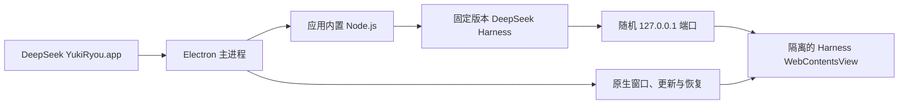

<p align="center">
  
</p>

<h1 align="center">DeepSeek YukiRyou</h1>

<p align="center">
  <strong>让 DeepSeek Harness 真正像一个 Mac 应用。</strong><br>
  为 Apple Silicon 打造的独立桌面开发环境，打开即可工作，无需手动维护 Node、端口或终端进程。
</p>

<p align="center">
  <a href="https://github.com/yoshino-xiao7/deepseek-yukiryou/releases/latest"></a>
  
  
  <a href="LICENSE"></a>
</p>

<p align="center">
  <a href="https://github.com/yoshino-xiao7/deepseek-yukiryou/releases">下载应用</a>
  ·
  <a href="docs/README.md">开发文档</a>
  ·
  <a href="https://github.com/yoshino-xiao7/deepseek-yukiryou/issues">反馈问题</a>
</p>

---

## 它解决什么问题

官方 DeepSeek Harness 提供 Web UI，但日常使用仍需要准备运行环境、启动命令、管理本地端口和处理异常退出。DeepSeek YukiRyou 把这些工作收进一个可安装的 macOS 应用：应用启动时拉起内置 Harness，退出时回收自己创建的进程，并用原生窗口承载完整 Web UI。

它不是 Harness 的重写版本，也不会改变 Agent 的工作方式。它专注于把 Harness 稳定、安全、可恢复地交付到桌面。

| 打开即用 | 原生体验 | 可诊断 | 安全更新 |
| --- | --- | --- | --- |
| 内置固定版本的 Node.js、pnpm 与 Harness | 原生交通灯、可拖动顶栏、侧栏动画同步 | 自动恢复运行时、日志轮转、脱敏诊断包 | Developer ID 签名、Apple 公证、应用内检查更新 |

## 下载与安装

前往 [GitHub Releases](https://github.com/yoshino-xiao7/deepseek-yukiryou/releases)，下载适用于 Apple Silicon 的 DMG：

```text
DeepSeek YukiRyou-<version>-arm64.dmg
```

1. 打开 DMG。
2. 将 **DeepSeek YukiRyou** 拖入“应用程序”。
3. 从 Launchpad 或“应用程序”目录启动。
4. 在 Harness 界面中完成所需的服务配置，然后开始工作。

系统要求：Apple Silicon Mac（M1 或更新芯片）、macOS 14 或更高版本。

每个正式版本同时提供 SHA-256 校验文件。应用和更新包均使用 Developer ID 签名并经过 Apple 公证；不要从 GitHub Releases 以外的非可信来源下载安装包。

## 桌面体验

- **一体化窗口**：本地顶栏与 Harness 共享视觉状态，浅色、深色和跟随系统主题会同步生效。
- **安静的生命周期**：单实例运行，关闭窗口时可隐藏，重新点击 Dock 图标即可恢复。
- **故障自恢复**：Harness 或本地界面异常退出时分别恢复，不让一个区域的故障拖垮整个窗口。
- **真正有用的设置**：“外观”负责桌面壳风格注入；“关于”展示版本、开发者信息，并可直接检查和安装更新。
- **更新不打扰**：应用定时后台检查；只有发现可安装版本时，主界面才显示更新入口。
- **隐私友好的诊断**：导出包只包含脱敏后的环境摘要和有界日志，不打包项目源码、会话或凭据。

## 它如何运行



Harness 只监听随机回环地址，不向局域网暴露服务。网页运行在关闭 Node 集成、启用上下文隔离与沙盒的独立视图中；桌面桥只开放经过校验的少量能力。更完整的边界与威胁模型见[安全设计](docs/03-security.md)。

## 版本与更新

应用启动后会自动检查公开 GitHub Release，也可以在“设置 → 关于”中手动检查。下载完成后由用户确认重启安装。

桌面壳、Node.js 与 Harness 被视为一个原子发布单元：应用不会在后台单独升级运行时，避免新旧组件组合产生不可复现的问题。正式发布固定执行一次 DMG 公证，再从已 staple 的 App 生成自动更新 ZIP。详细流程见[发布 Runbook](docs/09-github-and-apple-release.md)。

## 本地开发

### 准备环境

- Apple Silicon Mac
- macOS 14+
- Node.js 22.19+ 或 24+
- Corepack / pnpm 10.34.5

### 启动项目

```bash
corepack enable
pnpm install --frozen-lockfile
pnpm runtime:vendor -- --arch=arm64
pnpm dev
```

### 验证改动

```bash
pnpm check
pnpm test:e2e
pnpm package:mac -- --arch=arm64
```

正式签名、公证和发行只使用：

```bash
pnpm release:mac
```

该命令要求干净的 Git 工作区以及仓库外注入的 Apple 凭据。它完成 App/DMG 签名并只提交一次公证，保存 Submission ID 后立即退出，不维持长连接。之后运行 `pnpm release:mac:finish` 查询同一个 ID：处理中会立即返回，Accepted 后才执行 staple、Gatekeeper 验证、更新 ZIP、校验值和可追溯 manifest。不要手工重提文件。

## 固定运行时

| 组件 | 当前版本 | 策略 |
| --- | --- | --- |
| DeepSeek Harness | `0.1.0-rc.6` | 随应用固定并验证 |
| Node.js | `24.19.0` | Apple Silicon 内置运行时 |
| pnpm | `10.34.5` | 仅供内置 Harness 使用 |
| Electron | `43.4.0` | 桌面壳运行时 |

应用不会调用用户全局安装的 Node、dsh 或 pnpm，也不会在首次启动时在线安装依赖。

## 常见问题

<details>
<summary><strong>这是 DeepSeek 官方客户端吗？</strong></summary>

不是。这是由社区独立开发的 macOS 桌面项目，与 DeepSeek 官方没有隶属或背书关系。

</details>

<details>
<summary><strong>支持 Intel Mac 或 Windows 吗？</strong></summary>

当前只交付 Apple Silicon arm64 版本。Intel、Windows 和 Linux 不在当前发布范围内。

</details>

<details>
<summary><strong>为什么安装包比较大？</strong></summary>

为了做到离线可启动和版本可复现，应用内置了经过校验的 Node.js、pnpm 与 Harness 运行时，而不是依赖用户电脑上的全局环境。

</details>

<details>
<summary><strong>遇到启动问题怎么办？</strong></summary>

先使用应用菜单导出诊断包，再到 [Issues](https://github.com/yoshino-xiao7/deepseek-yukiryou/issues) 描述 macOS 版本、应用版本和复现步骤。提交前请自行确认附件中没有不希望公开的信息。

</details>

## 文档导航

- [产品范围](docs/01-product-scope.md)
- [系统架构](docs/02-architecture.md)
- [安全模型](docs/03-security.md)
- [测试与发布](docs/04-testing-and-release.md)
- [开发指南](docs/06-development-guide.md)
- [当前实现状态](docs/07-current-status.md)
- [外观扩展契约](docs/08-appearance-extension.md)
- [GitHub 与 Apple 发布 Runbook](docs/09-github-and-apple-release.md)

## 开发者与许可

由 [YukiRyou / yoshino-xiao7](https://github.com/yoshino-xiao7) 开发和维护，项目代码采用 [MIT License](LICENSE)。随包第三方运行时与依赖遵循各自许可证。

YukiRyou 角色视觉为本项目品牌资产。DeepSeek 与 DeepSeek Harness 名称归其各自权利人所有。
