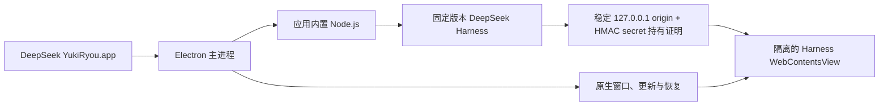

<p align="center">
  
</p>

<h1 align="center">DeepSeek YukiRyou — DeepSeek Harness Desktop for macOS</h1>

<p align="center">
  <strong>让 DeepSeek Harness 真正像一个 Mac 应用。</strong><br>
  为 Apple Silicon 打造的独立桌面工作台：内置运行时、账户余额、工作区审阅、文件预览与可信更新，打开即可工作。
</p>

<p align="center">
  <a href="https://github.com/yoshino-xiao7/deepseek-harness-desktop-yukiryou/releases/latest"></a>
  
  
  <a href="LICENSE"></a>
</p>

<p align="center">
  <strong>简体中文</strong> · <a href="README_EN.md">English</a>
</p>

<p align="center">
  <a href="https://github.com/yoshino-xiao7/deepseek-harness-desktop-yukiryou/releases">下载应用</a>
  ·
  <a href="docs/README.md">开发文档</a>
  ·
  <a href="https://github.com/yoshino-xiao7/deepseek-harness-desktop-yukiryou/issues">反馈问题</a>
  ·
  <a href="https://github.com/yoshino-xiao7/deepseek-harness-desktop-yukiryou">⭐ Star 支持</a>
</p>

<p align="center">
  如果这个项目对你有帮助，欢迎点一个 Star。它能帮助更多正在寻找 DeepSeek Harness macOS 客户端的人发现本项目。
</p>

---

## 项目定位

官方 DeepSeek Harness 提供 Web UI，但日常使用仍需要准备运行环境、启动命令、管理本地端口和处理异常退出。DeepSeek YukiRyou 把这些工作收进一个可安装的 macOS 应用：应用启动时拉起内置 Harness，退出时回收自己创建的进程，并用原生窗口承载完整 Web UI。

它不是 Harness 的重写版本，也不会改变 Agent 的工作方式。它专注于把 Harness 稳定、安全、可恢复地交付到桌面，并在官方界面之外补足账户状态、工作区文件和变更审核等桌面能力。

> 当前为 Apple Silicon Beta。已经上线的能力与后续路线图在本文中分开列出；标记为“开发中”或“规划中”的功能不包含在当前安装包中。

| 打开即用 | 原生体验 | 可诊断 | 安全更新 |
| --- | --- | --- | --- |
| 内置固定版本的 Node.js、pnpm 与 Harness | 原生交通灯、可拖动顶栏、侧栏动画同步 | 自动恢复运行时、日志轮转、脱敏诊断包 | Developer ID 签名、Apple 公证、应用内检查更新 |

## 下载与安装

前往 [GitHub Releases](https://github.com/yoshino-xiao7/deepseek-harness-desktop-yukiryou/releases)，下载适用于 Apple Silicon 的 DMG：

```text
DeepSeek.YukiRyou-<version>-arm64.dmg
```

1. 打开 DMG。
2. 将 **DeepSeek YukiRyou** 拖入“应用程序”。
3. 从 Launchpad 或“应用程序”目录启动。
4. 在 Harness 界面中完成所需的服务配置，然后开始工作。

系统要求：Apple Silicon Mac（M1 或更新芯片）、macOS 14 或更高版本。

每个正式版本同时提供 SHA-256 校验文件。应用和更新包均使用 Developer ID 签名并经过 Apple 公证；不要从 GitHub Releases 以外的非可信来源下载安装包。

## 当前可用功能

### 桌面与运行时

- **一体化窗口**：本地顶栏与 Harness 共享视觉状态，浅色、深色和跟随系统主题会同步生效。
- **内置固定运行时**：Node.js、pnpm 与 DeepSeek Harness 随应用交付，不读取用户全局安装，也不会在首次启动时联网安装依赖。
- **安静的生命周期**：单实例运行，关闭窗口时可隐藏，重新点击 Dock 图标即可恢复。
- **故障自恢复**：Harness 或本地界面异常退出时分别恢复，不让一个区域的故障拖垮整个窗口。

### 账户与工作区

- **账户余额**：在“设置”上方显示当前 DeepSeek 凭据所属账户的余额，不展示无法由官方接口精确提供的今日消费。
- **Desktop Companion**：可收起右栏提供当前工作区文件树、相对 HEAD 的 Git 变更、增删行统计和只读 diff。
- **适合阅读的预览**：Markdown 可在排版与源码之间切换，纯文本和常见图片也可在应用内预览。
- **逐轮变更入口**：在 Harness 原生“产物”行下方展示本轮确认变更，点击即可进入对应文件审核。

### 设置、安全与发布

- **真正有用的设置**：“外观”负责桌面壳风格注入；“关于”展示版本、开发者信息，并可直接检查和安装更新。
- **更新不打扰**：应用定时后台检查；只有发现可安装版本时，主界面才显示更新入口。
- **隐私友好的诊断**：导出包只包含脱敏后的环境摘要和有界日志，不打包项目源码、会话或凭据。
- **可信发布链**：候选包经过 Developer ID 签名、异机安装、真实应用稳定性测试、Apple 公证和最终产物复验后才会公开。

## 为什么选择 YukiRyou

- **面向 Apple Silicon 交付**：不是网页快捷方式，而是带固定 Node.js、pnpm 和 DeepSeek Harness 运行时的独立 macOS 应用。
- **工作区审阅闭环**：在对话之外直接查看文件树、当前 Git 变更、逐轮变更、增删行和 Markdown 渲染结果。
- **融入 Harness 的桌面能力**：账户余额、Companion 侧栏、设置与更新入口遵循现有界面节奏，不取代或篡改 Harness 的核心工作流。
- **发布结果可验证**：公开包经过 Developer ID 签名、Apple 公证、全新环境安装和真实应用稳定性验证，并附带 SHA-256 校验文件。

## 后续路线图

| 功能 | 状态 | 计划范围 |
| --- | --- | --- |
| 手机远程控制 | **规划中** | 通过明确配对和权限边界，在手机端查看任务状态、接收必要提醒，并在用户确认后继续任务；不会直接暴露本机 Harness 端口。 |
| 插件市场 | **规划中** | 提供插件发现、详情、安装、更新、移除和真实信任说明；冻结完整依赖图并完成 registry provenance/integrity、兼容性与回滚边界后再开放安装能力。 |
| Windows x64 发行 | **规划中** | 以 Windows 11 x64 为首发基线，共用 Plugin-first 产品能力，以 DesktopProductCarrier 与 DesktopFramePlugin 分离窗口载体和根布局，并为原生标题栏、Runtime、代码签名、安装和更新提供独立发布门。 |

路线图表示产品方向，不承诺具体发布日期。安全模型、上游 Harness 接口或素材准备不足时，相关功能会继续保持不可用，而不是通过不稳定的 DOM 注入或降低系统安全要求提前上线。

## 它如何运行



Harness 只监听由应用持久选择的稳定回环地址，不向局域网暴露服务；每次 Runtime 启动还必须通过随机密钥的 HMAC 挑战证明响应者持有本次 secret。一次性旧日志迁移会采用物理顺序中的最后 ready origin，但轮转日志里保留的全部不同 ready 端口都必须先释放；任一遗留 Runtime 仍占用端口，都会在复制或打开 Runtime Home 前失败关闭。网页运行在关闭 Node 集成、启用上下文隔离与沙盒的独立视图中；桌面桥只开放经过校验的少量能力。该证明不等于 OS 级进程隔离，更完整的边界见[安全设计](docs/03-security.md)。

## 版本与更新

应用启动后会自动检查公开 GitHub Release，也可以在“设置 → 关于”中手动检查。下载完成后由用户确认重启安装。

从 `v0.2.1-beta.2` 升级到首个 rc.8 版本前，请先通过应用菜单完整退出旧版。若旧版曾被强制退出、主进程崩溃，或你手动清理过桌面日志，请先重启 macOS 再安装；旧版 Runtime 没有 owner watchdog，且本次一次性 origin 迁移需要保留的最后 ready 记录。重启可避免新旧 Runtime 并发写数据，但 ready 记录已经丢失时，升级后可能需要从侧栏手动重新选择一次原会话。

桌面壳、Node.js 与 Harness 被视为一个原子发布单元：应用不会在后台单独升级运行时，避免新旧组件组合产生不可复现的问题。正式发布固定执行一次 DMG 公证，再从已 staple 的 App 生成自动更新 ZIP。详细流程见[发布 Runbook](docs/09-github-and-apple-release.md)。

## 本地开发

### 准备环境

- Apple Silicon Mac
- macOS 14+
- Node.js 22.19+ 或 24+
- Corepack / pnpm 10.34.5

### 启动项目

```bash
corepack enable
pnpm install --frozen-lockfile
pnpm runtime:vendor -- --arch=arm64
pnpm dev
```

### 验证改动

```bash
pnpm check
pnpm test:e2e
pnpm package:mac -- --arch=arm64
```

正式签名、公证和发行只通过 GitHub Actions 的 **Release macOS** 工作流执行。本机只能生成不可发布的签名候选：

```bash
export MACOS_SIGN_IDENTITY="Developer ID Application: ... (...)"
pnpm release:mac:candidate
```

工作流使用多个全新 Apple Silicon runner：先验证候选复制到 `/Applications` 后仍能验签和启动，才允许提交 Apple；公证后的 DMG 与 ZIP 还会在另一个 runner 上重新安装、Gatekeeper 验证并启动。全部通过后只创建 Draft，显式允许后才公开 Release。详见 [发布规则](docs/09-github-and-apple-release.md)和[更新日志](CHANGELOG.md)。

## 固定运行时

| 组件 | 当前版本 | 策略 |
| --- | --- | --- |
| DeepSeek Harness | `0.1.0-rc.8` | 随应用固定并验证 |
| Node.js | `24.19.0` | Apple Silicon 内置运行时 |
| pnpm | `10.34.5` | 仅供内置 Harness 使用 |
| Electron | `43.4.0` | 桌面壳运行时 |

应用不会调用用户全局安装的 Node、dsh 或 pnpm，也不会在首次启动时在线安装依赖。

## 常见问题

<details>
<summary><strong>这是 DeepSeek 官方客户端吗？</strong></summary>

不是。这是由社区独立开发的 macOS 桌面项目，与 DeepSeek 官方没有隶属或背书关系。

</details>

<details>
<summary><strong>支持 Intel Mac 或 Windows 吗？</strong></summary>

当前只交付 Apple Silicon arm64 版本。Intel、Windows 和 Linux 不在当前发布范围内。

</details>

<details>
<summary><strong>为什么安装包比较大？</strong></summary>

为了做到离线可启动和版本可复现，应用内置了经过校验的 Node.js、pnpm 与 Harness 运行时，而不是依赖用户电脑上的全局环境。

</details>

<details>
<summary><strong>遇到启动问题怎么办？</strong></summary>

先使用应用菜单导出诊断包，再到 [Issues](https://github.com/yoshino-xiao7/deepseek-harness-desktop-yukiryou/issues) 描述 macOS 版本、应用版本和复现步骤。提交前请自行确认附件中没有不希望公开的信息。

</details>

## 文档导航

- [产品范围](docs/01-product-scope.md)
- [系统架构](docs/02-architecture.md)
- [安全模型](docs/03-security.md)
- [测试与发布](docs/04-testing-and-release.md)
- [开发指南](docs/06-development-guide.md)
- [当前实现状态](docs/07-current-status.md)
- [外观扩展契约](docs/08-appearance-extension.md)
- [GitHub 与 Apple 发布 Runbook](docs/09-github-and-apple-release.md)
- [English README](README_EN.md)

## 参与项目

- 如果项目解决了你的问题，可以通过 [Star](https://github.com/yoshino-xiao7/deepseek-harness-desktop-yukiryou) 支持它。
- 遇到可复现问题，请使用 [Bug 反馈表单](https://github.com/yoshino-xiao7/deepseek-harness-desktop-yukiryou/issues/new?template=bug-report.yml)。
- 有明确使用场景或产品建议，请使用 [功能建议表单](https://github.com/yoshino-xiao7/deepseek-harness-desktop-yukiryou/issues/new?template=feature-request.yml)。
- 反馈前建议先安装[最新版本](https://github.com/yoshino-xiao7/deepseek-harness-desktop-yukiryou/releases/latest)，并附上应用版本、macOS 版本和 Apple 芯片型号。

## 开发者与许可

由 [YukiRyou / yoshino-xiao7](https://github.com/yoshino-xiao7) 开发和维护，项目代码采用 [MIT License](LICENSE)。随包第三方运行时与依赖遵循各自许可证。

DeepSeek 与 DeepSeek Harness 名称归其各自权利人所有。
